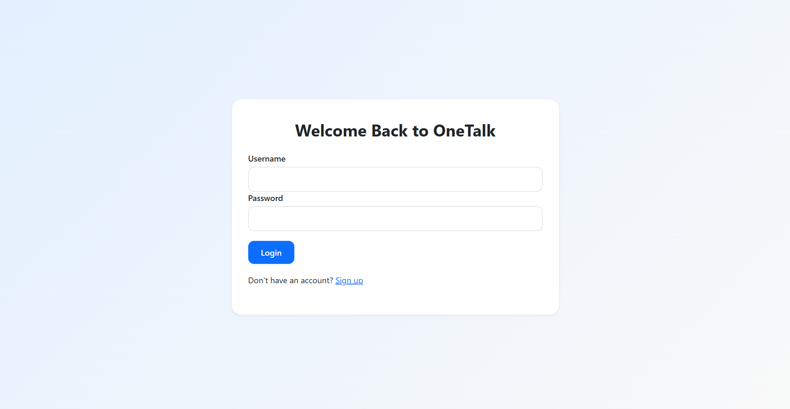
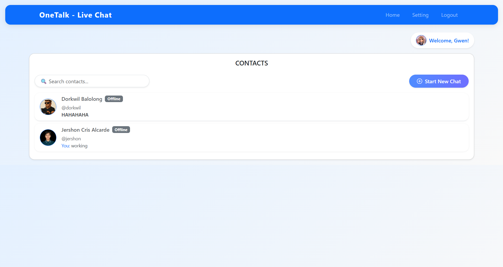
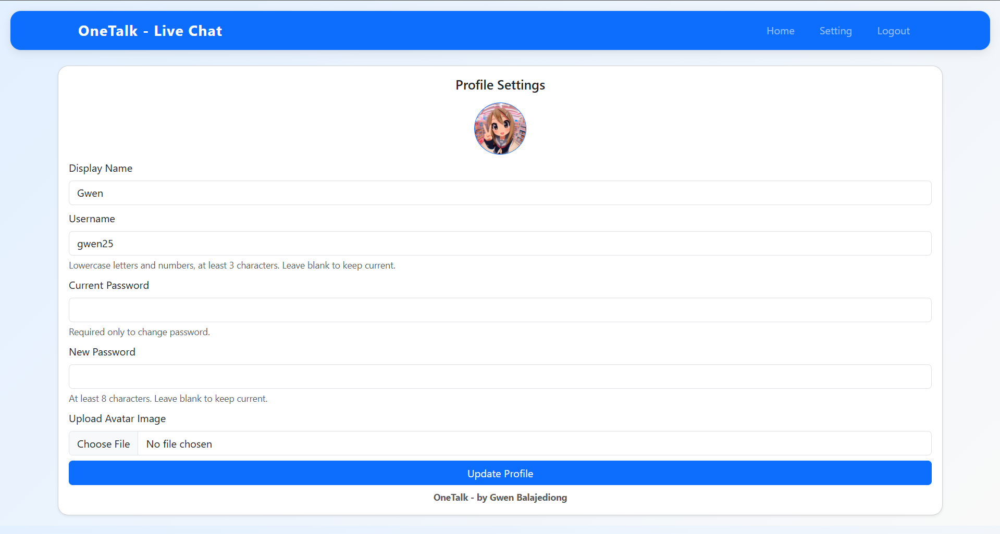

# GwezTalk - PHP Live Chat System

**GwezTalk** (also known as **OneTalk**) is a fully working, modern live chat system built using **PHP**, **MySQL**, **GitHub Copilot**, and **Bootstrap 5**. It enables user registration, login, and 1-to-1 private messaging with real-time status updates and avatar support.

---

## ✅ Features

- 🧑‍💼 User registration & secure login  
- 🧑‍🤝‍🧑 User dashboard with contact list  
- 💬 One-to-one private messaging system  
- 🟢 Online/offline status tracking  
- 👤 Profile editing with custom avatar  
- ⌚ Real-time message, read and seen feature  
- 📱 Responsive Bootstrap 5 interface  

---

## 📸 Screenshots

### 🔐 Login Page

### 🗂️ Dashboard

### ⚙️ Profile Settings

---

## 🙌 Credits

**Project Author:** [Gwen Balajediong](https://github.com/gwenz2)  
**Project Name:** GwezTalk (aka OneTalk)  
**Built With:** PHP, MySQL, Bootstrap 5, GitHub Copilot  
**UI Inspired by:** Modern messaging platforms (Messenger, WhatsApp)  
**Icons & Assets:** Bootstrap Icons, FlatIcon, custom avatars

---

> ⭐ If you like this project, consider starring it on GitHub or contributing a feature!
