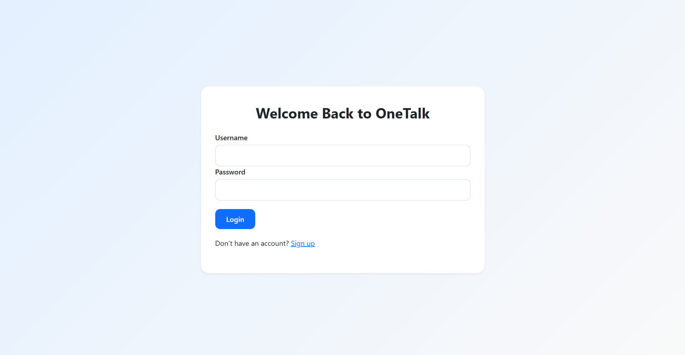
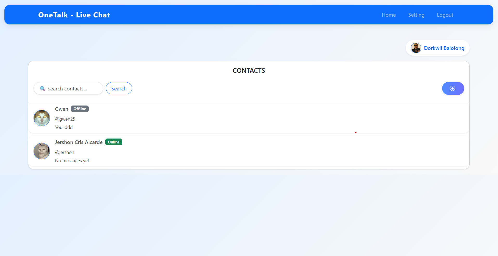
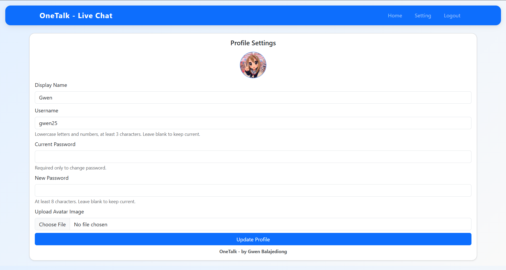

# GwezTalk - Modern Firebase Live Chat System

**GwezTalk** (also known as **OneTalk**) is a fully working, modern real-time chat system built using **PHP**, **Firebase**, **Google Authentication**, and **Bootstrap 5**. It features secure user authentication, real-time messaging, smart caching, and a clean modern interface inspired by popular messaging platforms.

---

## ✅ Features

### � Authentication & Security
- 🔑 **Google OAuth Integration** - Secure sign-in with Google accounts
- 🛡️ **Firebase Authentication** - Industry-standard user management
- 🔒 **Secure Database Rules** - Protected data access with proper permissions

### 💬 Real-Time Messaging
- ⚡ **Instant Messaging** - Real-time chat with Firebase Realtime Database
- � **Private 1-to-1 Chats** - Secure isolated conversations between users
- 👁️ **Read/Unread Indicators** - See message status with visual formatting
- ⌨️ **Typing Indicators** - "User is typing..." notifications
- � **Last Message Preview** - See recent messages in contact list

### 👥 Social Features  
- 🧑‍🤝‍🧑 **Friend System** - Send, accept, and manage friend requests
- 👤 **Smart Avatar Priority** - Google photos → Custom URLs → Default avatars
- 🟢 **"In this chat" Status** - Clean presence system without clutter
- 🔍 **User Search** - Find and add new contacts

### ⚡ Performance & UX
- 🚀 **Smart Caching System** - 5-minute localStorage cache for faster loading
- 📱 **Responsive Design** - Perfect on mobile, tablet, and desktop
- 🎨 **Modern UI** - Clean Bootstrap 5 interface with smooth animations
- ⚙️ **Profile Settings** - Easy profile and avatar management  

---

## 📸 Screenshots

### 🔐 Login Page


### 🗂️ Dashboard


### ⚙️ Profile Settings


---

## �️ Tech Stack

- **Backend:** PHP 8+ with Firebase integration
- **Database:** Firebase Realtime Database
- **Authentication:** Firebase Auth with Google OAuth
- **Frontend:** HTML5, CSS3, JavaScript (ES6+)
- **UI Framework:** Bootstrap 5.3+ with custom styling
- **Icons:** Bootstrap Icons
- **Development:** GitHub Copilot assisted development

---

## 🚀 Installation & Setup

1. **Clone the repository:**
   ```bash
   git clone https://github.com/gwenz2/php-live-chat-system.git
   cd php-live-chat-system
   ```

2. **Set up Firebase:**
   - Create a Firebase project at [console.firebase.google.com](https://console.firebase.google.com)
   - Enable Authentication and Realtime Database
   - Configure Google Sign-In provider
   - Update Firebase config in the PHP files

3. **Configure web server:**
   - Ensure PHP 8+ is installed
   - Place files in web server directory (e.g., `htdocs` for XAMPP)
   - Access via `http://localhost/php-live-chat-system-main/`

---

## 🔧 Firebase Security Rules

For proper security, apply these Firebase Realtime Database rules:

```javascript
{
  "rules": {
    "users": {
      ".read": "auth != null",
      "$uid": {
        ".write": "auth != null && auth.uid == $uid"
      }
    },
    "friendRequests": {
      ".read": "auth != null",
      ".write": "auth != null"
    },
    "friends": {
      ".read": "auth != null", 
      "$uid": {
        ".write": "auth != null && auth.uid == $uid"
      }
    },
    "chats": {
      ".read": "auth != null",
      ".write": "auth != null"
    },
    "typing": {
      ".read": "auth != null",
      ".write": "auth != null"
    }
  }
}
```

---

## �🙌 Credits & Acknowledgments

**Project Author:** [Gwen Balajediong](https://github.com/gwenz2)  
**Project Name:** GwezTalk (aka OneTalk)  
**Development:** Enhanced with GitHub Copilot assistance  
**UI Inspiration:** Modern messaging platforms (WhatsApp, Telegram, Discord)  
**Open Source:** MIT License - feel free to use and modify!

---

## 📈 Recent Updates

- ✅ **Firebase Migration** - Moved from MySQL to Firebase for real-time capabilities
- ✅ **Caching System** - Implemented smart localStorage caching for performance
- ✅ **Chat Isolation** - Fixed 1-to-1 private messaging with proper chat rooms
- ✅ **UI Improvements** - Last message previews, read indicators, modern design
- ✅ **Performance** - Optimized Firebase queries and reduced API calls

---

> ⭐ **Star this repo if you find it useful!** 
> 🍴 **Fork it to create your own chat system!**  
> 🐛 **Report issues or contribute features!**
